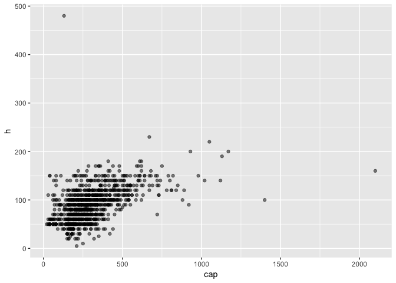

Vou usar o pacote `dplyr` para manipular o dado:

``` r
library(dplyr)
library(readr)

caixeta <- 
  "http://ecologia.ib.usp.br/bie5782/lib/exe/fetch.php?media=dados:caixeta.csv" %>%
  read_csv() %>%
  arrange(local, arvore, fuste)

caixeta
```

    # A tibble: 1,027 × 7
        local parcela arvore fuste   cap     h                especie
        <chr>   <int>  <int> <int> <int> <int>                  <chr>
    1  chauas       1      1     1   210    80      Myrcia sulfiflora
    2  chauas       1      3     1   170    80      Myrcia sulfiflora
    3  chauas       1      4     1   720    70 Syagrus romanzoffianus
    4  chauas       1      5     1   200    80   Tabebuia cassinoides
    5  chauas       1      6     1   750   170                indet.1
    6  chauas       1      7     1   320    80      Myrcia sulfiflora
    7  chauas       1      8     1   480   160   Tabebuia cassinoides
    8  chauas       1      9     1   240   140   Tabebuia cassinoides
    9  chauas       1     10     1   290   120   Tabebuia cassinoides
    10 chauas       1     10     2   310   120   Tabebuia cassinoides
    # ... with 1,017 more rows

### Espécies

Vamos checar se uma mesma árvore (mesmo `local` e `arvore`) pode estar com valores de `especie` diferentes no dado `caixeta`.

``` r
caixeta %>%
  group_by(local, arvore) %>%
  filter(n_distinct(especie) > 1)
```

    Source: local data frame [4 x 7]
    Groups: local, arvore [2]

       local parcela arvore fuste   cap     h              especie
       <chr>   <int>  <int> <int> <int> <int>                <chr>
    1 jureia       4    117     1   370    90           Psidium sp
    2 jureia       4    117     2   510   130 Tabebuia cassinoides
    3 retiro       1     16     1   330    80               Mela 1
    4 retiro       1     16     2   135    80 Tabebuia cassinoides

De fato, vemos que há 2 árvores classificadas em 2 espécies diferentes.

### Alturas

Será que uma mesma árvore pode estar com valores de altura (`h`) diferentes?

``` r
caixeta %>%
  group_by(local, arvore) %>%
  filter(n_distinct(h) > 1)
```

    Source: local data frame [17 x 7]
    Groups: local, arvore [3]

        local parcela arvore fuste   cap     h              especie
        <chr>   <int>  <int> <int> <int> <int>                <chr>
    1  jureia       4    117     1   370    90           Psidium sp
    2  jureia       4    117     2   510   130 Tabebuia cassinoides
    3  retiro       1     26     1   185    60 Tabebuia cassinoides
    4  retiro       1     26     2   265    60 Tabebuia cassinoides
    5  retiro       1     26     3    70    60 Tabebuia cassinoides
    6  retiro       1     26     4    70    60 Tabebuia cassinoides
    7  retiro       1     26     5    45    60 Tabebuia cassinoides
    8  retiro       1     26     6   110    60 Tabebuia cassinoides
    9  retiro       1     26     7   275   160 Tabebuia cassinoides
    10 retiro       1     28     1   390    90 Tabebuia cassinoides
    11 retiro       1     28     1   465   100 Tabebuia cassinoides
    12 retiro       1     28     2   150    90 Tabebuia cassinoides
    13 retiro       1     28     2   245   100 Tabebuia cassinoides
    14 retiro       1     28     3   160    90 Tabebuia cassinoides
    15 retiro       1     28     4   250    90 Tabebuia cassinoides
    16 retiro       1     28     5   330    90 Tabebuia cassinoides
    17 retiro       1     28     6   200    90 Tabebuia cassinoides

De fato, podemos observar que há 3 árvores com 2 valores diferentes para altura.

Em alguns fustes, elas tem valores de `h` diferentes. Já havíamos visto a árvore 117 do local *jureia* no problema das espécies. A árvore 26 do local *retiro* tem um `h` diferente para o fuste 7. Já a árvore 28 do local *retiro* tem 2 entradas para os fustes 1 e 2, mas com valores de `h` diferentes.

### Visualização

Ao plotar a `cap` pela `h`, percebemos que há valores muito extremos:

``` r
library(ggplot2)

ggplot(caixeta, aes(cap, h)) + 
  geom_point(alpha = 1/2)
```



Checando os valores mais extremos para `cap`:

``` r
caixeta %>%
  arrange(desc(cap))
```

    # A tibble: 1,027 × 7
        local parcela arvore fuste   cap     h                   especie
        <chr>   <int>  <int> <int> <int> <int>                     <chr>
    1  jureia       4    106     1  2100   160  Calophyllum brasiliensis
    2  jureia       4    105     1  1400   100      Tabebuia cassinoides
    3  jureia       1     26     1  1170   200      Tabebuia cassinoides
    4  chauas       4    199     1  1130   190 Callophyllum brasiliensis
    5  chauas       5    245     1  1120   140 Callophyllum brasiliensis
    6  jureia       1     28     1  1050   220      Tabebuia cassinoides
    7  chauas       2     83     1  1020   140 Callophyllum brasiliensis
    8  jureia       1      1     1   980   150      Tabebuia cassinoides
    9  chauas       4    186     1   930   200 Callophyllum brasiliensis
    10 retiro       1     14     1   920    90                   Ilex sp
    # ... with 1,017 more rows

Vamos também checar os valores extremos de `h`:

``` r
caixeta %>%
  arrange(desc(h))
```

    # A tibble: 1,027 × 7
        local parcela arvore fuste   cap     h                   especie
        <chr>   <int>  <int> <int> <int> <int>                     <chr>
    1  chauas       5    232     1   130   480      Tabebuia cassinoides
    2  chauas       1     23     1   670   230      Tabebuia cassinoides
    3  jureia       1     28     1  1050   220      Tabebuia cassinoides
    4  chauas       4    186     1   930   200 Callophyllum brasiliensis
    5  jureia       1     26     1  1170   200      Tabebuia cassinoides
    6  chauas       4    199     1  1130   190 Callophyllum brasiliensis
    7  jureia       2     49     1   610   180      Tabebuia cassinoides
    8  jureia       2     67     1   620   180      Tabebuia cassinoides
    9  jureia       2     67     2   410   180      Tabebuia cassinoides
    10 chauas       1      6     1   750   170                   indet.1
    # ... with 1,017 more rows

Parecem OK?
