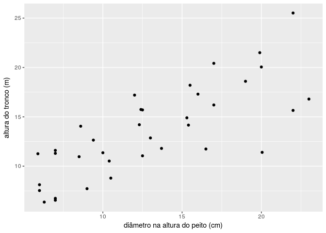
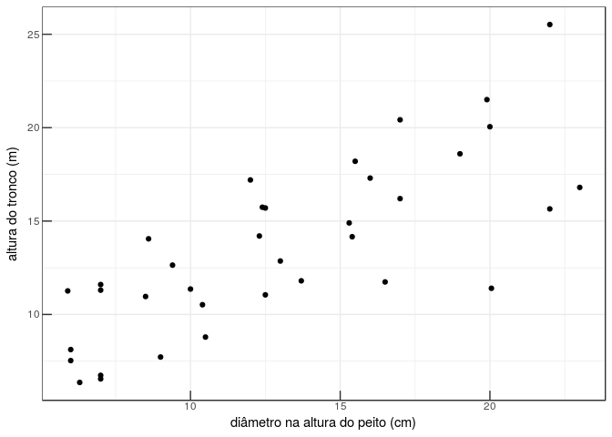
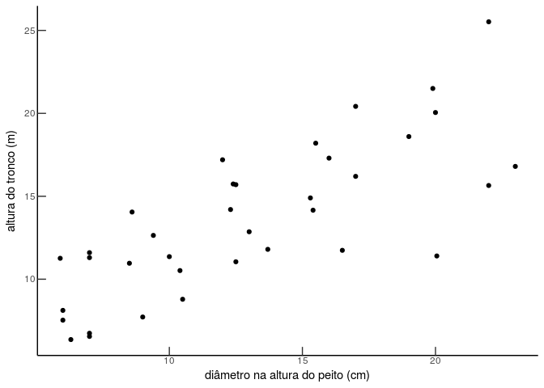
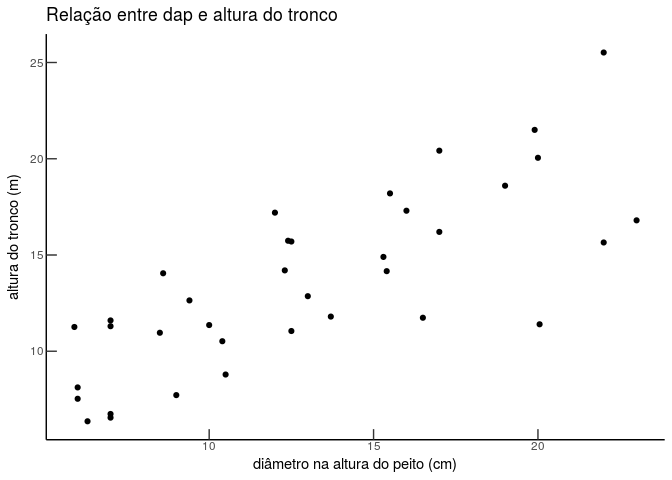
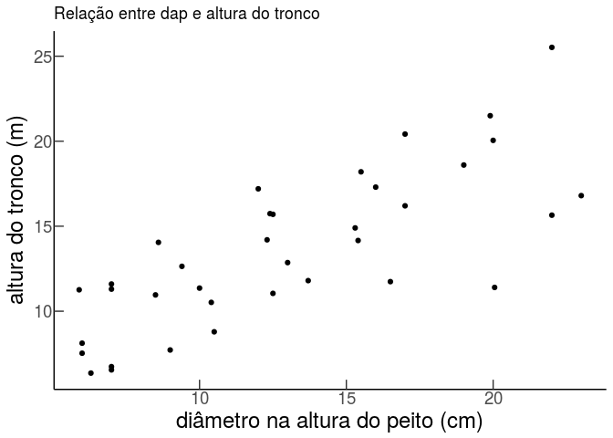
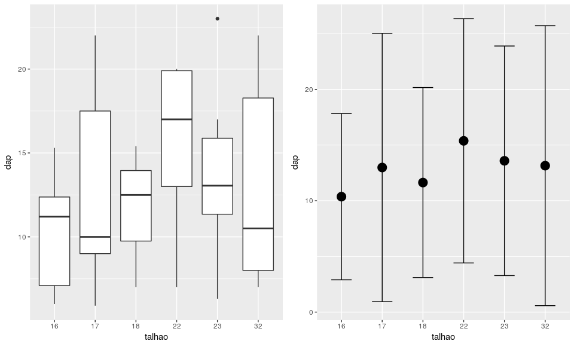
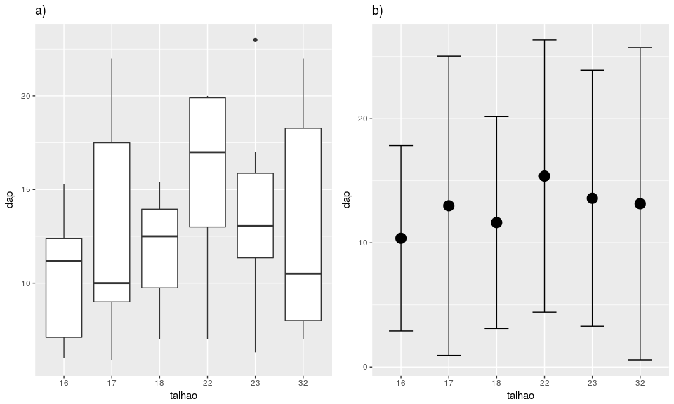
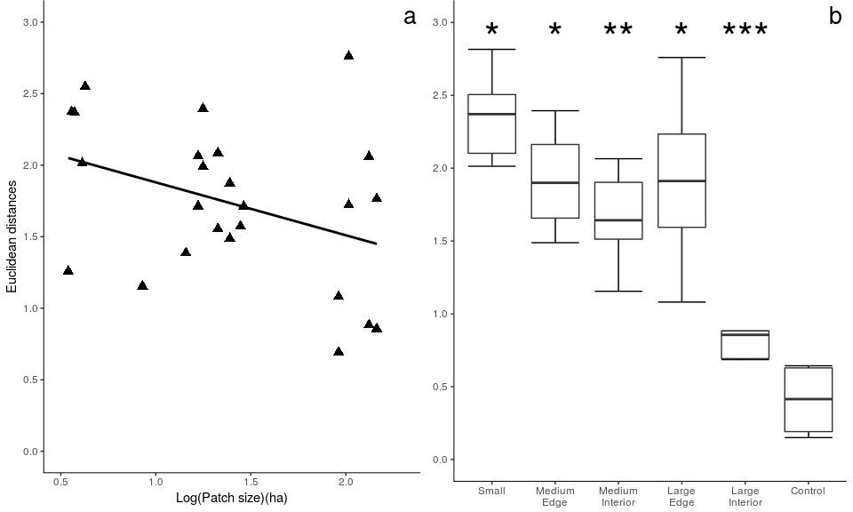

Exercicio 5
================
Vitor Aguiar

**[Exercicios 5 - Criação de Gráficos](http://ecologia.ib.usp.br/bie5782/doku.php?id=bie5782:01_curso_atual:exercicios5)**

Usando o [Conjunto de Dados: Dados de Biomassa de Árvores de *Eucalyptus saligna*](http://ecologia.ib.usp.br/bie5782/doku.php?id=dados:dados-esaligna), construa os seguintes gráficos:

#### Ler o dado no R:

``` r
esaligna <- read.csv("http://ecologia.ib.usp.br/bie5782/lib/exe/fetch.php?media=dados:esaligna.csv")

str(esaligna)
```

    'data.frame':   36 obs. of  9 variables:
     $ arvore: int  6 8 7 8 9 9 1 2 1 2 ...
     $ classe: Factor w/ 4 levels "a","b","c","d": 3 2 3 1 1 2 3 3 1 1 ...
     $ talhao: int  22 23 32 32 32 32 22 22 22 23 ...
     $ dap   : num  19.9 12.4 16.5 9 7 10.5 13 20 7 6.3 ...
     $ ht    : num  21.5 15.74 11.74 7.72 6.55 ...
     $ tronco: num  183.6 42.3 60.6 12.3 11.9 ...
     $ sobra : num  20.42 6.58 11.35 9.99 7.97 ...
     $ folha : num  8.57 2.52 48.52 27.67 7.76 ...
     $ total : num  212.6 51.4 120.5 50 27.6 ...

### 5.1 Editando alguns parâmetros gráficos

``` r
library(ggplot2)
library(grid)
```

Crie um gráfico de dispersão entre `dap` e `ht` com:

**1. Legendas dos eixos com nomes das variáveis e suas unidades**

``` r
p <- 
  ggplot(esaligna, aes(x = dap, y = ht)) + 
  geom_point() +
  labs(x = "diâmetro na altura do peito (cm)", y = "altura do tronco (m)")

p
```



**2. Marcações do eixos (ticks) para dentro da área do gráfico**

``` r
p <- 
  p + 
  theme_bw() + 
  theme(axis.ticks.length=unit(-8, "points"), 
        axis.text.x = element_text(margin = margin(t = 10)),
        axis.text.y = element_text(margin = margin(r = 10)))

p
```



**3. Apenas dois eixos (formato “L”)**

``` r
p <- 
  p + 
  theme_classic() +
  theme(axis.ticks.length=unit(-8, "points"), 
        axis.text.x = element_text(margin = margin(t = 10)),
        axis.text.y = element_text(margin = margin(r = 10)))

p
```



**4. Título informativo**

``` r
p <- p + labs(title = "Relação entre dap e altura do tronco")

p
```



**5. Tamanho das fontes maiores que o padrão**

``` r
p + theme(axis.title = element_text(size = 18),
          axis.text = element_text(size = 14))
```



### 5.2 Dois gráficos juntos

**1. Use as variáveis “dap” e “talhao” para construir dois gráficos, colocando-os lado a lado. O primeiro deve ser um gráfico de desenho de caixa (boxplot) da variável “dap” em função do fator “talhão”. O segundo deve ter apenas a média e uma barra de desvio-padrão do dap, para cada talhão.**

Dica: vocês terão que calcular a média e os desvios-padrão do dap das árvores em cada talhão. Depois crie uma matriz com estes valores e crie o plot destes valores.

*Com o ggplot2, não é necessário pré-computar a média e o desvio padrão, `stat_summary` faz isso pra você!* *Mas no gráfico `p_media_desvio` é necessário ter o pacote `Hmisc` instalado para usar a função `mean_sdl`.*

``` r
p_box <- 
  ggplot(esaligna, aes(factor(talhao), dap)) +
  geom_boxplot() +
  labs(x = "talhao")
  
p_media_desvio <-
  ggplot(esaligna, aes(factor(talhao), dap)) + 
  stat_summary(fun.y = "mean", geom = "point", size = 5) +
  stat_summary(fun.data = "mean_sdl", geom = "errorbar", width = 0.5) +
  labs(x = "talhao")

pushViewport(viewport(layout = grid.layout(1, 2)))
print(p_box, vp = viewport(layout.pos.row = 1, layout.pos.col = 1))
print(p_media_desvio, vp = viewport(layout.pos.row = 1, layout.pos.col = 2))
```



**2. Insira também uma letra para dizer qual é o gráfico “a” e qual é o “b” (tanto faz, quem é um e quem é outro).**

``` r
p_box <-
  p_box + 
  labs(title = "a)")

p_media_desvio <-
  p_media_desvio + 
  labs(title = "b)") 

pushViewport(viewport(layout = grid.layout(1, 2)))
print(p_box, vp = viewport(layout.pos.row = 1, layout.pos.col = 1))
print(p_media_desvio, vp = viewport(layout.pos.row = 1, layout.pos.col = 2))
```



### 5.3 Adivinhando o código

**Leia os dados [deste arquivo](http://ecologia.ib.usp.br/bie5782/lib/exe/fetch.php?media=bie5782:01_curso2009:material:exercicio3.csv) e usando as variáveis `x1` e `y1` e `x2` e `y2` tente reproduzir esta figura:**

``` r
dat <- read.csv("http://ecologia.ib.usp.br/bie5782/lib/exe/fetch.php?media=bie5782:01_curso2009:material:exercicio3.csv")

p_a <- 
  ggplot(data = dat, aes(x1, y1)) + 
  geom_point(size = 3, shape = 17) + 
  geom_smooth(method = lm, se = FALSE, color = "black") +
  scale_x_continuous(breaks = seq(.5, 2, .5), limits = c(0.5, 2.3)) +
  scale_y_continuous(breaks = seq(0, 3, .5), limits = c(0, 3)) +
  labs(title = "a", x = "Log(Patch size)(ha)", y = "Euclidean distances") + 
  theme_bw() +
  theme(plot.title = element_text(hjust = .99, size = 20, margin = margin(b = -20)),
        panel.border= element_blank(),
        panel.grid = element_blank(),
        axis.line.x = element_line(),
        axis.line.y = element_line())

p_b <- 
  ggplot(data = dat, aes(factor(y2), x2)) + 
  stat_boxplot(geom = "errorbar") +
  geom_boxplot(outlier.shape = NA) +
  scale_x_discrete(labels = c("Small", "Medium\nEdge", "Medium\nInterior",
                              "Large\nEdge", "Large\nInterior", "Control")) +
  scale_y_continuous(breaks = seq(0, 3, .5), limits = c(0, 3)) +
  labs(title = "b") +
  theme_bw() +
  theme(axis.title = element_blank(), 
        plot.title = element_text(hjust = .99, size = 20, margin = margin(b = -20)),
        panel.border= element_blank(),
        panel.grid = element_blank(),
        axis.line.x = element_line(),
        axis.line.y = element_line()) +
  annotate("text", x = 1:6, y = 2.9, 
           label = c("*", "*", "**", "*", "***", ""), size = 12) 

pushViewport(viewport(layout = grid.layout(1, 2)))
print(p_a, vp = viewport(layout.pos.row = 1, layout.pos.col = 1))
print(p_b, vp = viewport(layout.pos.row = 1, layout.pos.col = 2))
```



Esse documento foi gerado com os seguintes pacotes:

    Session info --------------------------------------------------------------

     setting  value                       
     version  R version 3.3.1 (2016-06-21)
     system   x86_64, linux-gnu           
     ui       X11                         
     language en_US                       
     collate  en_US.UTF-8                 
     tz       Brazil/East                 
     date     2016-12-08                  

    Packages ------------------------------------------------------------------

     package      * version    date       source                         
     acepack        1.4.1      2016-10-29 CRAN (R 3.3.1)                 
     assertthat     0.1        2013-12-06 CRAN (R 3.3.1)                 
     backports      1.0.4      2016-10-24 CRAN (R 3.3.1)                 
     base64         2.0        2016-05-10 CRAN (R 3.3.1)                 
     chron          2.3-47     2015-06-24 CRAN (R 3.3.1)                 
     cluster        2.0.5      2016-10-08 CRAN (R 3.3.1)                 
     colorspace     1.2-7      2016-10-11 CRAN (R 3.3.1)                 
     data.table     1.9.6      2015-09-19 CRAN (R 3.3.1)                 
     devtools       1.12.0     2016-06-24 CRAN (R 3.3.1)                 
     digest         0.6.10     2016-08-02 CRAN (R 3.3.1)                 
     evaluate       0.10       2016-10-11 CRAN (R 3.3.1)                 
     foreign        0.8-67     2016-09-13 CRAN (R 3.3.1)                 
     Formula        1.2-1      2015-04-07 CRAN (R 3.3.1)                 
     ggplot2      * 2.2.0.9000 2016-12-06 Github (hadley/ggplot2@f6f9f9d)
     gridExtra      2.2.1      2016-02-29 CRAN (R 3.3.1)                 
     gtable         0.2.0      2016-02-26 CRAN (R 3.3.1)                 
     Hmisc          4.0-1      2016-12-08 CRAN (R 3.3.1)                 
     htmlTable      1.7        2016-10-19 CRAN (R 3.3.1)                 
     htmltools      0.3.5      2016-03-21 CRAN (R 3.3.1)                 
     knitr          1.15.1     2016-11-22 CRAN (R 3.3.1)                 
     labeling       0.3        2014-08-23 CRAN (R 3.3.1)                 
     lattice        0.20-34    2016-09-06 CRAN (R 3.3.1)                 
     latticeExtra   0.6-28     2016-02-09 CRAN (R 3.3.1)                 
     lazyeval       0.2.0      2016-06-12 CRAN (R 3.3.1)                 
     magrittr       1.5        2014-11-22 CRAN (R 3.3.1)                 
     Matrix         1.2-7.1    2016-09-01 CRAN (R 3.3.1)                 
     memoise        1.0.0      2016-01-29 CRAN (R 3.3.1)                 
     munsell        0.4.3      2016-02-13 CRAN (R 3.3.1)                 
     nnet           7.3-12     2016-02-02 CRAN (R 3.2.3)                 
     openssl        0.9.4      2016-05-25 CRAN (R 3.3.1)                 
     plyr           1.8.4      2016-06-08 CRAN (R 3.3.1)                 
     RColorBrewer   1.1-2      2014-12-07 CRAN (R 3.3.1)                 
     Rcpp           0.12.8     2016-11-17 cran (@0.12.8)                 
     rmarkdown      1.2        2016-11-21 CRAN (R 3.3.1)                 
     rpart          4.1-10     2015-06-29 CRAN (R 3.2.1)                 
     rprojroot      1.1        2016-10-29 CRAN (R 3.3.1)                 
     scales         0.4.1      2016-11-09 cran (@0.4.1)                  
     stringi        1.1.2      2016-10-01 CRAN (R 3.3.1)                 
     stringr        1.1.0      2016-08-19 CRAN (R 3.3.1)                 
     survival       2.40-1     2016-10-30 CRAN (R 3.3.1)                 
     tibble         1.2        2016-08-26 CRAN (R 3.3.1)                 
     withr          1.0.2      2016-06-20 CRAN (R 3.3.1)                 
     yaml           2.1.14     2016-11-12 CRAN (R 3.3.1)
