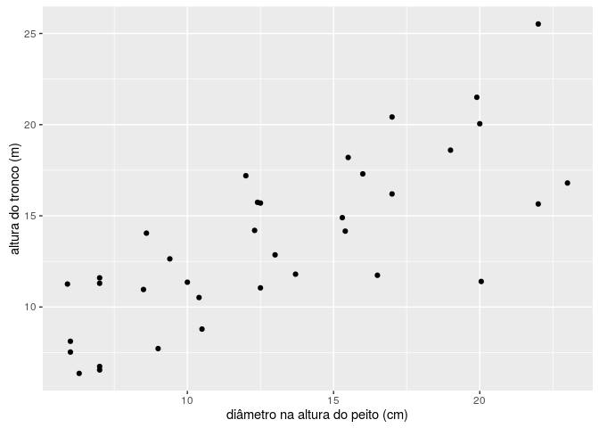
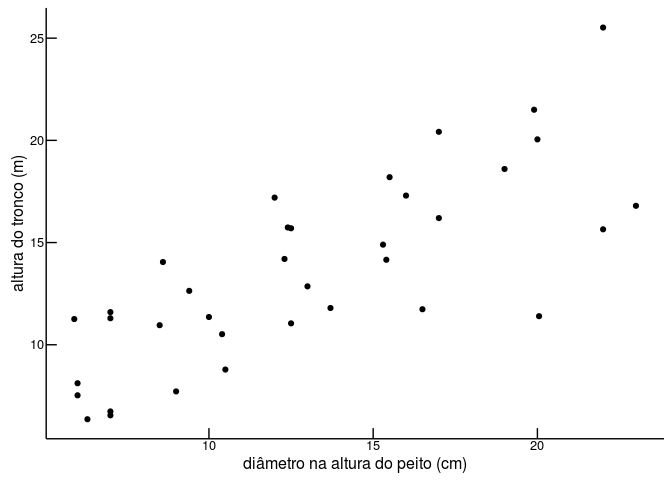
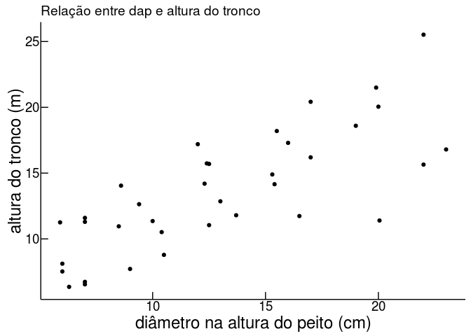
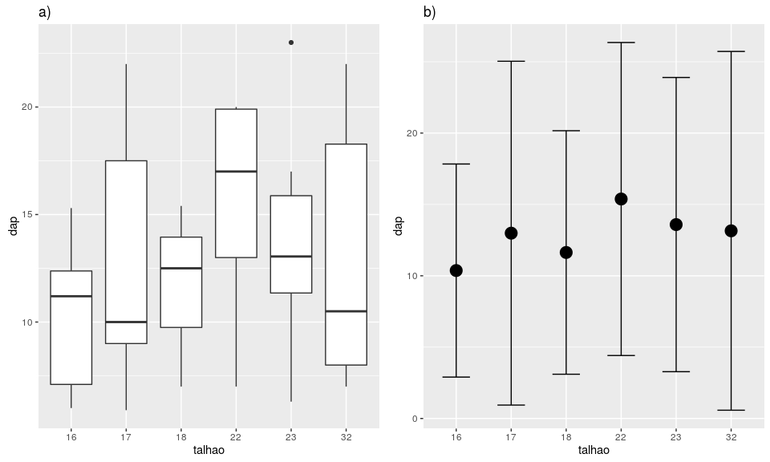
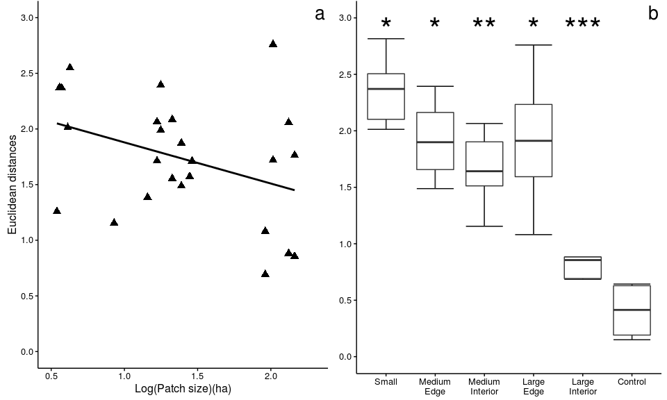

Usando o [Conjunto de Dados: Dados de Biomassa de Árvores de *Eucalyptus
saligna*](http://ecologia.ib.usp.br/bie5782/doku.php?id=dados:dados-esaligna),
construa os seguintes gráficos:

#### Ler o dado no R:

    esaligna <- read.csv("http://ecologia.ib.usp.br/bie5782/lib/exe/fetch.php?media=dados:esaligna.csv")

    str(esaligna)

    'data.frame':   36 obs. of  9 variables:
     $ arvore: int  6 8 7 8 9 9 1 2 1 2 ...
     $ classe: Factor w/ 4 levels "a","b","c","d": 3 2 3 1 1 2 3 3 1 1 ...
     $ talhao: int  22 23 32 32 32 32 22 22 22 23 ...
     $ dap   : num  19.9 12.4 16.5 9 7 10.5 13 20 7 6.3 ...
     $ ht    : num  21.5 15.74 11.74 7.72 6.55 ...
     $ tronco: num  183.6 42.3 60.6 12.3 11.9 ...
     $ sobra : num  20.42 6.58 11.35 9.99 7.97 ...
     $ folha : num  8.57 2.52 48.52 27.67 7.76 ...
     $ total : num  212.6 51.4 120.5 50 27.6 ...

### 5.1 Editando alguns parâmetros gráficos

    library(ggplot2)
    library(grid)

Crie um gráfico de dispersão entre `dap` e `ht` com:

**1. Legendas dos eixos com nomes das variáveis e suas unidades**

    p <- 
      ggplot(esaligna, aes(x = dap, y = ht)) + 
      geom_point() +
      labs(x = "diâmetro na altura do peito (cm)", y = "altura do tronco (m)")

    p

**2. Marcações do eixos (ticks) para dentro da área do gráfico**

    p + 
      theme_bw() + 
      theme(axis.ticks.length=unit(-8, "points"), 
            axis.text.x = element_text(margin = margin(t = 10)),
            axis.text.y = element_text(margin = margin(r = 10)))

**3. Apenas dois eixos (formato “L”)**

    p <- p + 
      theme_bw() + 
      theme_classic() +
      theme(axis.ticks.length=unit(-8, "points"), 
            axis.text.x = element_text(margin = margin(t = 10)),
            axis.text.y = element_text(margin = margin(r = 10)))

    p

**4. Título informativo**

    p <- p + labs(title = "Relação entre dap e altura do tronco")

    p

**5. Tamanho das fontes maiores que o padrão**

    p + theme(axis.title = element_text(size = 18),
              axis.text = element_text(size = 14))

### Dois gráficos juntos

**1. Use as variáveis “dap” e “talhao” para construir dois gráficos,
colocando-os lado a lado. O primeiro deve ser um gráfico de desenho de
caixa (boxplot) da variável “dap” em função do fator “talhão”. O segundo
deve ter apenas a média e uma barra de desvio-padrão do dap, para cada
talhão.**

    p_box <- 
      ggplot(esaligna, aes(factor(talhao), dap)) +
      geom_boxplot() +
      xlab("talhao")
      
    p_media_desvio <-
      ggplot(esaligna, aes(factor(talhao), dap)) + 
      stat_summary(fun.y = "mean", geom = "point", size = 5) +
      stat_summary(fun.data = "mean_sdl", geom = "errorbar", width = 0.5) +
      xlab("talhao")

    pushViewport(viewport(layout = grid.layout(1, 2)))
    print(p_box, vp = viewport(layout.pos.row = 1, layout.pos.col = 1))
    print(p_media_desvio, vp = viewport(layout.pos.row = 1, layout.pos.col = 2))

**2. Insira também uma letra para dizer qual é o gráfico “a” e qual é o
“b” (tanto faz, quem é um e quem é outro).**

    p_box <-
      p_box + 
      labs(title = "a)") + 
      theme(plot.title = element_text(hjust = 0))

    p_media_desvio <-
      p_media_desvio + 
      labs(title = "b)") + 
      theme(plot.title = element_text(hjust = 0))

    pushViewport(viewport(layout = grid.layout(1, 2)))
    print(p_box, vp = viewport(layout.pos.row = 1, layout.pos.col = 1))
    print(p_media_desvio, vp = viewport(layout.pos.row = 1, layout.pos.col = 2))

Dica: vocês terão que calcular a média e os desvios-padrão do dap das
árvores em cada talhão. Depois crie uma matriz com estes valores e crie
o plot destes valores.

*Com o ggplot2, não é necessário pré-computar a média e o desvio padrão,
`stat_summary` faz isso pra você!* *Mas no gráfico `p_media_desvio` é
necessário ter o pacote `Hmisc` instalado para usar a função `mean_sdl`*

### 5.3 Adivinhando o código

**Leia os dados [deste
arquivo](http://ecologia.ib.usp.br/bie5782/lib/exe/fetch.php?media=bie5782:01_curso2009:material:exercicio3.csv)
e usando as variáveis `x1` e `y1` e `x2` e `y2` tente reproduzir esta
figura:**

    dat <- read.csv("http://ecologia.ib.usp.br/bie5782/lib/exe/fetch.php?media=bie5782:01_curso2009:material:exercicio3.csv")

    p_a <- 
      ggplot(data = dat, aes(x1, y1)) + 
      geom_point(size = 3, shape = 17) + 
      geom_smooth(method = "lm", se = FALSE, color = "black") +
      xlab("Log(Patch size)(ha)") +
      ylab("Euclidean distances") + 
      labs(title = "a") + 
      theme_classic() +
      theme(plot.title = element_text(hjust = .99, vjust = -1.5, size = 20)) +
      coord_cartesian(ylim = c(0, 3))

    p_b <- 
      ggplot(data = dat, aes(factor(y2), x2)) + 
      stat_boxplot(geom ='errorbar') + 
      geom_boxplot(outlier.shape = NA) +
      scale_x_discrete(labels=c("Small", "Medium\nEdge", "Medium\nInterior",
                                "Large\nEdge", "Large\nInterior", "Control")) +
      labs(title = "b") +
      theme_classic() +
      theme(axis.title = element_blank(), 
            plot.title = element_text(hjust = .99, vjust = -1.5, size = 20)) +
      coord_cartesian(ylim = c(0 ,3)) +
      annotate("text", x = 1:6, y = 2.9, label = c("*", "*", "**", "*", "***", ""), 
               size = 12) 

    pushViewport(viewport(layout = grid.layout(1, 2)))
    print(p_a, vp = viewport(layout.pos.row = 1, layout.pos.col = 1))
    print(p_b, vp = viewport(layout.pos.row = 1, layout.pos.col = 2))

